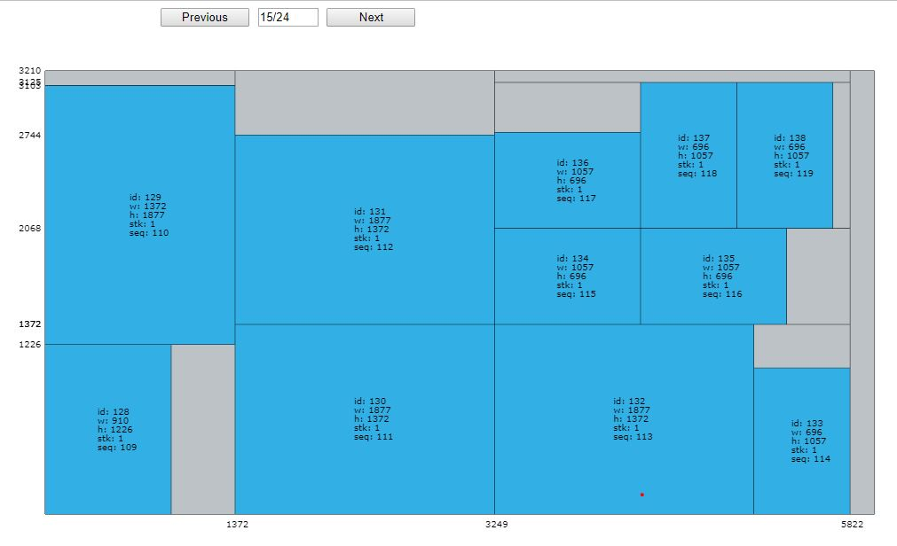
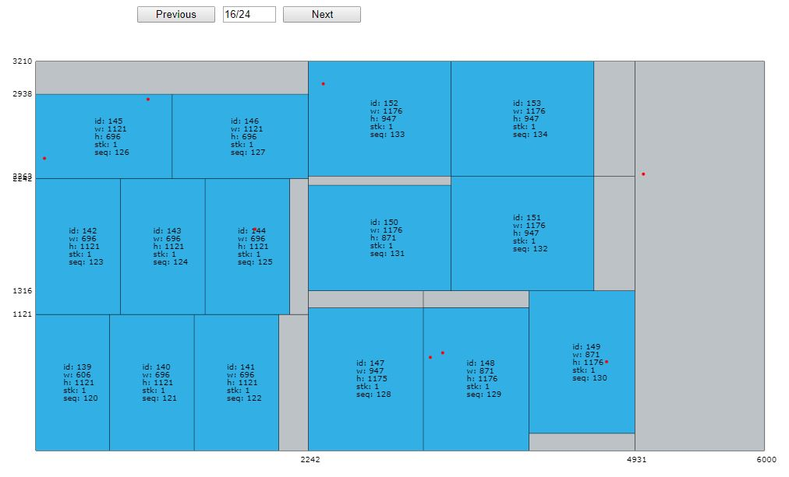

# BUG FIX 524fec

时间：2019.10.31
代码版本：524fec167cc9885579682e082693fb6dcd1fcb82
算例：B5
随机种子：5574379683

## 问题分析

+ 以上两幅图是B5在15和16块原料上的解，可以看出，物品避开瑕疵的位置似乎出错了，第16块原料上的物品试图避开第15块原料上的瑕疵。

+ 猜测问题的原因可能是TopSearch的plateid没有及时更新导致的，但是为什么该版本的代码只有B5出了问题？
    - 最后发现问题是PlateSearch中的最后一块原料重复计算时没有考虑到边界条件导致的。

+ [x] 关于原料错位的错误又如何在代码中检查？
    - 通过assert宏测试来定位bug，效果很好。