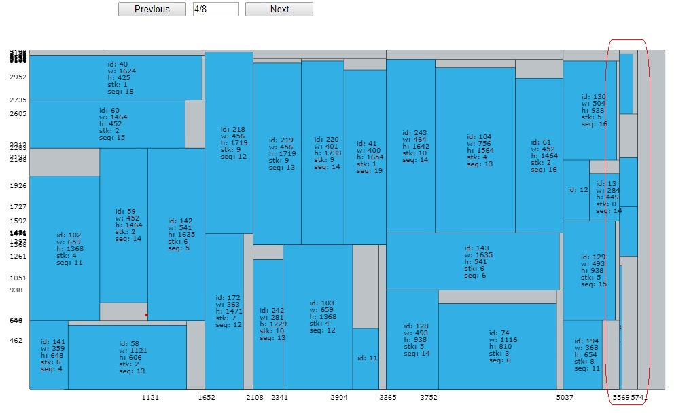
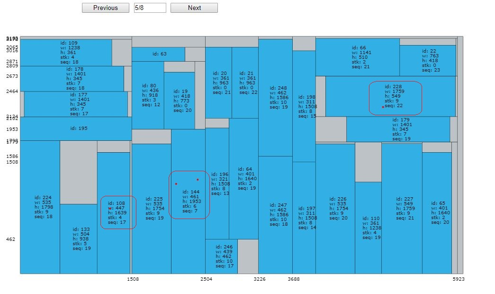

# Bug Fix 7e0afb

+ 待修复代码版本：7e0afb827aa325bbb01af47b4abade1f89566c6e
+ 日期：2019_10_28

## 问题还原

+ 测试算例B4，Release模式下运行180s，出现值为负数的节点宽度。
    > PLATE_ID;NODE_ID;X;Y;WIDTH;HEIGHT;TYPE;CUT;PARENT
    > 4;575;5569;0;-4848;3210;-2;1;475
    > 4;576;5569;0;-4848;1481;-2;2;575

+ 且在该出现问题的原料以后，所有的瑕疵都被忽略了。

## 检查清单

+ [ ] 获取Solution格式的解，记录**plate_4**中最后一个1-cut内物品信息（1-cut start_pos，物品id，顺序）。
+ [ ] 单独测试CutSearch，看该1-cut算出来的解是否异常。
+ [ ] 检查PlateSearch在调用CutSearch时传递的**plate_id**等参数是否正常。

# 该bug无法重现，放弃！！！

+ 改了程序中无关Solver的部分，却会影响运行结果，这个现象值得重视。
