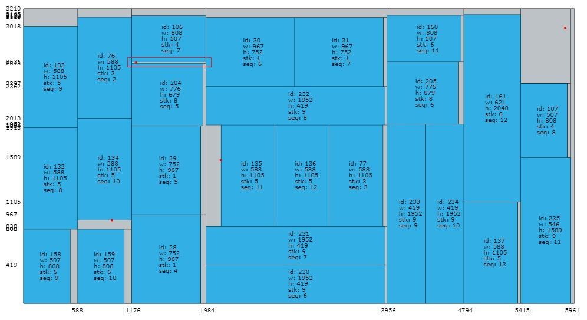

# aa790b bug fix

## 日期

2019.8.30

## 测试环境

+ Windows10 64bit
+ Visual Studio 2017
+ Release x64 -O2

## 代码版本

zjl->SHA-1: aa790bb0d6d9d307823013bf2ea4a0793b07448a

## 问题日志

|Time|ID|Instance|Feasible|ObjMatch|Width|Duration|PhysMem|VirtMem|RandSeed|Config|UtilRatio|CheckerObj|
|----|--|--------|--------|--------|-----|--------|-------|-------|--------|------|---------|----------|
|2019-08-30_20:46:04|0|Instance/A13|0|36911605|77979|125.258|4.055MB|1.219MB|1567226023|GB2;mcin=8;mbpn=4;mbcn=1|85.25%|8|

## Checker检查结果

> ERROR -- Node 229: (type: waste, width: 808, height: 13) has node.height less than 20mm

## 解中非法节点

> |PLATE_ID|NODE_ID|X|Y|WIDTH|HEIGHT|TYPE|CUT|PARENT|
> |-------|-------|-|-|-----|------|----|---|------|
> |2|229|1176|2613|808|13|-1|4|228|

## bug可视化

图中方框处**Waste**高度小于**20mm**，违反了**minWasteHeight**约束。

## bug解决

+ sliptoDefectUp中`return res != -1 && res - x < GV::param.minWasteHeight ? x + GV::param.minWasteHeight : res;`改为`return res != -1 && res - y < GV::param.minWasteHeight ? y + GV::param.minWasteHeight : res;`
