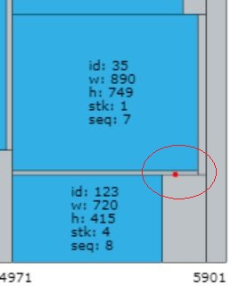

# bug fix f2314e

+ bug发现日期：2019.11.16
+ 对应代码版本：SHA-1: f2314e7f23463c088329589a68eba1c6eb2b0b79
+ 测试环境：release -O2；最大运行时长：3600s；算例：B3；随机种子：1578278521。

# bug分析

+ 从结果可视化和Checker输出信息可以发现，该bug系2-cut切过瑕疵造成的。
+ 推断是当1层桶被撑大时，未检测2-cut的撑大部分是否穿过瑕疵导致的问题。

# 修复措施

+ CutSearch::cut2ThroughDefect函数中将2-cut延长到整个原料宽度，加大检查力度。