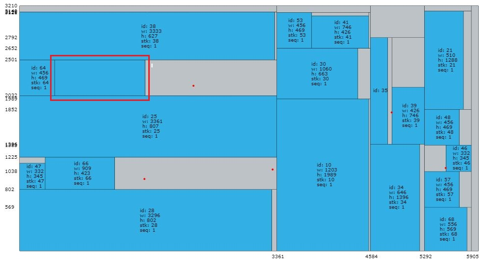
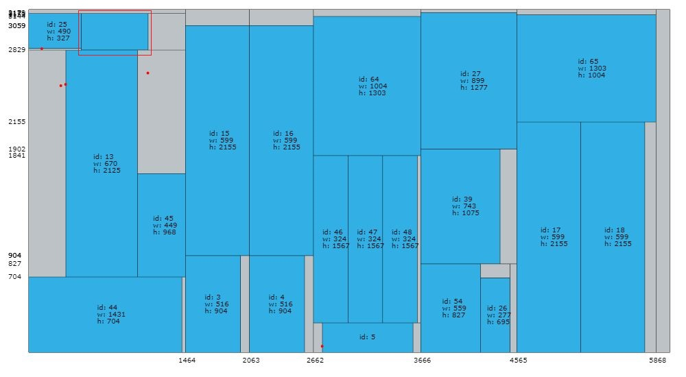
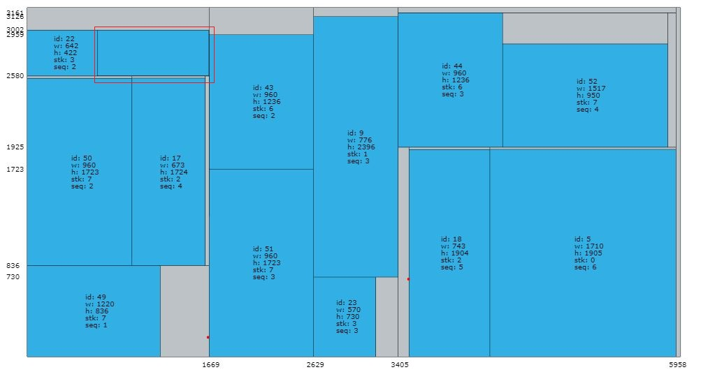
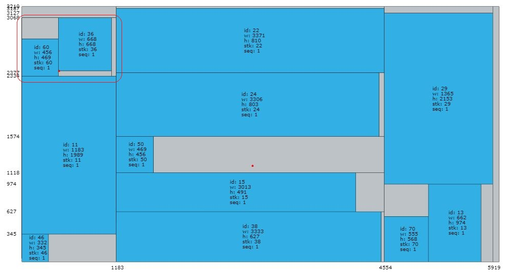

# fa777b Fix Log

## 时间

2019.8.30

## 测试环境

+ Windows10 64bit
+ Visual Studio 2017
+ Release x64 -O2
+ 使用多线程

## 代码版本

zjl->SHA-1: fa777b808e4f4598ff1c241ba65507f0fc07a2b4

## Bug类型

共测试20个算例**A1~A20**,其中五个算例输出解不合法

## 非法算例

|Time|ID|Instance|Feasible|ObjMatch|Width|Duration|PhysMem|VirtMem|RandSeed|Config|UtilRatio|CheckerObj|
|----|--|--------|--------|--------|-----|--------|-------|-------|--------|------|---------|----------|
|2019-08-30_10:07:12|0|Instance/A2|0|38277899|35975|5.378|4.336MB|1.273MB|1567131183|GB2;mcin=8;mbpn=4;mbcn=1|66.85%|0|
|2019-08-30_10:07:22|0|Instance/A4|0|15559290|17868|2.932|4.434MB|1.367MB|1567141602|GB2;mcin=8;mbpn=4;mbcn=1|72.87%|0|
|2019-08-30_10:07:34|0|Instance/A7|0|6774210|23978|2.57|4.477MB|1.402MB|1567153651|GB2;mcin=8;mbpn=4;mbcn=1|91.2%|0|
|2019-08-30_10:08:07|0|Instance/A13|0|36895563|77974|119.53|4.648MB|1.488MB|1567186858|GB2;mcin=8;mbpn=4;mbcn=1|85.26%|0|
|2019-08-30_10:10:07|0|Instance/A14|0|43215258|83980|135.931|4.742MB|1.645MB|1567306570|GB2;mcin=8;mbpn=4;mbcn=1|83.97%|0|

## 分析

### 算例A2

+ checker检查结果

    > ERROR: One attribute of a node is negative or null, please check Solution file
    > error node id:174

+ 解中非法节点

    > |PLATE_ID|NODE_ID|X|Y|WIDTH|HEIGHT|TYPE|CUT|PARENT|
    > |-------|-------|-|-|-----|------|----|---|------|
    > |2|174|456|2032|1183|-1520|-1|4|173|

+ 可视化位置

    

+ 调试发现

    方框处对应**item8**，高度为**1989**，此处明显放不下该物品，说明**约束检查**部分代码有问题！！！

### 算例A4

+ checker检查结果

    > ERROR: One attribute of a node is negative or null, please check Solution file
    > error node id:142

+ 解中非法节点

    > |PLATE_ID|NODE_ID|X|Y|WIDTH|HEIGHT|TYPE|CUT|PARENT|
    > |-------|-------|-|-|-----|------|----|---|------|
    > |1|142|490|2829|625|-1113|-1|4|141|

+ 可视化位置

    

### 算例A7

+ checker检查结果

    > ERROR: One attribute of a node is negative or null, please check Solution file
    > error node id:83

+ 解中非法节点

    > |PLATE_ID|NODE_ID|X|Y|WIDTH|HEIGHT|TYPE|CUT|PARENT|
    > |-------|-------|-|-|-----|------|----|---|------|
    > |1|83|642|2580|1025|-1288|-1|4|82|

+ 可视化位置

    

算例A13,A14情况和以上基本相同，不再重复描述

-----------

## 新测试环境

由于Release模式下-O2优化不方便调试，所以在新环境下又测试了一次算例A2，结果发现了新的bug。

+ Windows10 64bit
+ Visual Studio 2017
+ Release x64 -Od
+ 不使用多线程

## bug2

### A2

+ Checker检查结果

    > ERROR: One attribute of a node is negative or null, please check Solution file
    > error node id:248

+ 解中非法节点

    > |PLATE_ID|NODE_ID|X|Y|WIDTH|HEIGHT|TYPE|CUT|PARENT|
    > |-------|-------|-|-|-----|------|----|---|------|
    > |3|248|0|3068|1183|-2572|-2|2|232|

+ 可视化位置

    

+ 调试发现

    红框处缺少**item51**，因为其**c2cpb=3068**而**c2cpu=496**，出现错误！！！
